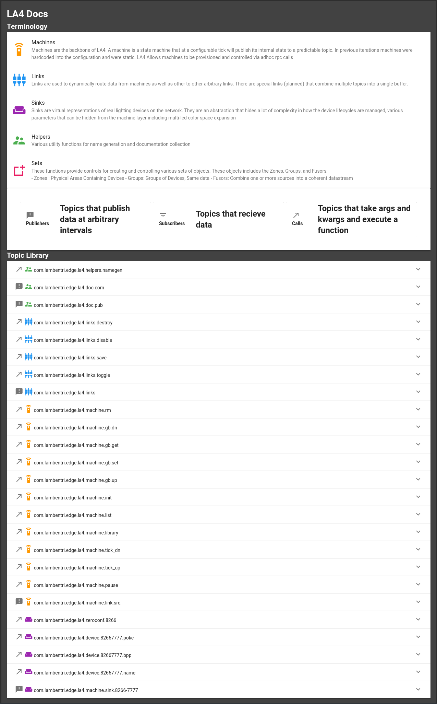

# Lambent Aether 4

## Motivations

A lighting server composed of on the fly configurable state machines, routing elements, and virtual hardware devices

## Features

TODO

## Documentation Snapshot

# Deployment

## Kube

TODO

## Compose

`docker-compose up`

# Development

`pip install -r requirements.txt`

`crossbar start` will start the router bit
then you'll need all the other components you'll be using
so avahi_8266.py, links.py, machine.py, helpers.py

visit localhost:8080 to drive the UI

# Building

This will build the container with all the components in router [details](https://crossbar.io/docs/Container-Configuration/)

`docker build -t la4 -f Dockerfile-all . `

If you'd like to run the router in docker but develop against it, the command below will do so without any of the components

`docker build -t la4-dev -f Dockerfile . `

# Running

Port 8080 needs to be exposed on the container and avahi needs to be able to access the actual network, so run `docker run --net=host -p 8080:8080 la4`

# Env Vars

## All Pieces

XBAR_ROUTER a crossbar URI for being invoked in dev mode defaulting to `u"ws://127.0.0.1:8080/ws"` which is the default shit

## machine.py

*LA4_CONFIG_PATH* Path to a config file. We default to the included `default.yml` for the full cpu melting experience

# Other Notes

## avahi_8266.py

This sink module is exposing devices flashed with https://github.com/cnlohr/esp8266ws2812i2s and announcing themselves over avahi/bonjour/zeroconf
This system assumes avahi/bonjour/zeroconf works on your network
